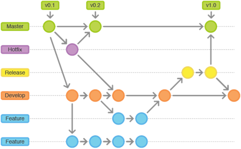
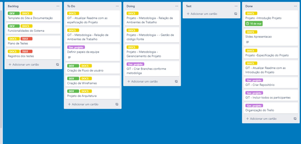
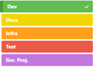

# Metodologia

Pré-requisitos: <a href="2-Especificação do Projeto.md"> Documentação de Especificação</a>

A metodologia contempla as definições de ferramental utilizado pela equipe tanto para a manutenção dos códigos e demais artefatos quanto para a organização do time na execução das tarefas do projeto.

## Relação de Ambientes de Trabalho

Os artefatos do projeto são desenvolvidos a partir de diversas plataformas e a relação dos ambientes com seu respectivo propósito é apresentada na tabela que se segue. 

| Ambiente                  | Plataforma | Link de Acesso |
|---------------------------|------------|----------------|
|Repositório de código fonte| GitHub     |https://github.com/ICEI-PUC-Minas-PMV-ADS/pmv-ads-2022-1-e1-proj-web-t9-pomodoro-s-organizer.git|
| Documentos do projeto| Google Docs | https://docs.google.com/document/d/1Xlw0FP2C48U8rgUlzFBIsQBvQUKiXIMN/edit#|
| Projeto de Interface e  Wireframes | Figma | https://www.figma.com/file/1p9jKcxxm16ezfSxHefMhE/Untitled?node-id=0%3A1|
| Gerenciamento do Projeto | Trello | https://trello.com/b/Jj4MNXnv/projeto-front-end|

## Gestão de código fonte
Para gestão do código fonte do software desenvolvido pela equipe, o grupo utiliza um processo baseado no Git Flow abordado por Vietro (2015), mostrado na Figura a seguir. Desta forma, todas as manutenções no código são realizadas em branches separados, identificados como Hotfix, Release, Develop e Feature. Uma explicação rápida sobre este processo é apresentada no vídeo ["The gitflow workflow - in less than 5 mins"](https://www.youtube.com/watch?v=1SXpE08hvGs)

 
Figura 2 - Fluxo de controle do código fonte no repositório git

## Gerenciamento do Projeto

A equipe utiliza metodologias ágeis, tendo escolhido o Scrum como base para definição do processo de desenvolvimento.

A equipe está organizada da seguinte maneira:

- **Scrum Master:**
    - Luciano Ribeio do Prado
 
- **Product Owner:**
    - Arthur Beraldo Ribeiro Diniz
    
- **Equipe de Desenvolvimento:**
    - Leonardo Moreira Franco de Souza
    - Lucas Eduardo Honório da Silva
    
- **Equipe de Design:**
   - Isabela Aparecida dos Santos

Para organização e distribuição das tarefas do projeto, a equipe está utilizando o Trello estruturado com as seguintes listas: 

- **Recursos:** esta lista mantém template de tarefas recorrentes com as configurações padronizadas que todos devem seguir. O objetivo é permitir a cópia destes templates para agilizar a criação de novos cartões.
- **Backlog:** recebe as tarefas a serem trabalhadas e representa o Product Backlog. Todas as atividades identificadas no decorrer do projeto também devem ser incorporadas a esta lista.
- **To Do:** Esta lista representa o Sprint Backlog. Este é o Sprint atual que estamos trabalhando.
- **Doing:** Quando uma tarefa tiver sido iniciada, ela é movida para cá.
- **Test:** Checagem de Qualidade. Quando as tarefas são concluídas, eles são movidas para o “CQ”. No final da semana, eu revejo essa lista para garantir que tudo saiu perfeito.
- **Done:** nesta lista são colocadas as tarefas que passaram pelos testes e controle de qualidade e estão prontos para ser entregues ao usuário. Não há mais edições ou revisões necessárias, ele está agendado e pronto para a ação.
- **Locked:** Quando alguma coisa impede a conclusão da tarefa, ela é movida para esta lista juntamente com um comentário sobre o que está travando a tarefa.

O quadro kanban do grupo no Trello está disponível através da URL https://trello.com/b/Jj4MNXnv/projeto-front-end e é apresentado, no estado atual, na Figura 3. A definição desta estrutura se baseou na proposta feita por Littlefield (2016).

 
Figura 4 - Tela do kanban utilizada pelo grupo

A tarefas são, ainda, etiquetadas em função da natureza da atividade e seguem o seguinte esquema de cores/categorias:
 
 <table align="center">
    <tbody>
        <tr>
         <td>
            <ul>
                <li>Dev -Desenvolvimento</li>
                <li>Docs - Documentação</li>
                <li>Infra - Infraestrutura</li>
                <li>Test - Testes</li>
                <li>Ger.Proj. - Gerência de Projetos</li>
            </td>
            <td>
                
            </td>
        </tr>
    </tbody>
 </table>

