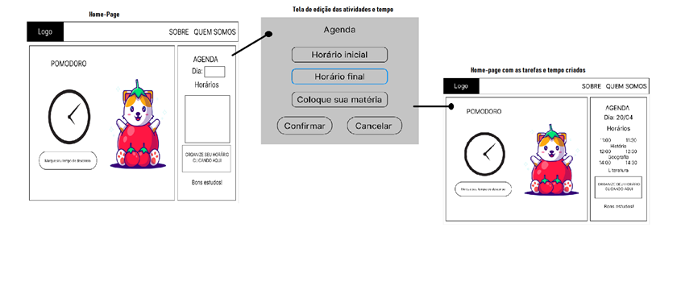
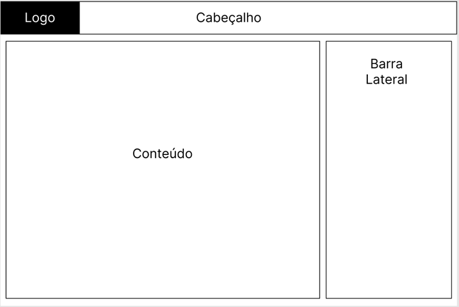
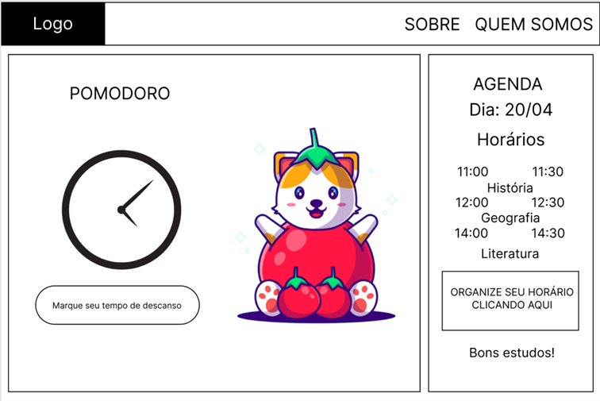
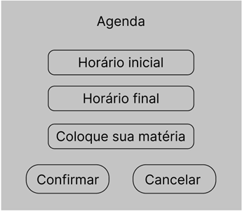

# Projeto de Interface

Pré-requisitos: <a href="2-Especificação do Projeto.md"> Documentação de Especificação</a>

Dentre as preocupações para a montagem da interface do sistema, estamos estabelecendo foco em questões como agilidade, acessibilidade e usabilidade. Desta forma, o projeto tem uma identidade visual padronizada em todas as telas que são projetadas para funcionamento em desktops e dispositivos móveis

## Fluxo do Usuário

O diagrama apresentado na Figura 4 mostra o fluxo de interação do usuário pelas telas do sistema. Cada uma das telas deste fluxo é detalhada na seção de Wireframes que se segue. Para visualizar o wireframe interativo, acesse o [ambiente Figma do projeto](https://www.figma.com/file/1p9jKcxxm16ezfSxHefMhE/Untitled?node-id=0%3A1).

 
Figura 4 - Fluxo de telas do usuário

## Wireframes

Conforme fluxo de telas do projeto, apresentado no item anterior, as telas do sistema são apresentadas em detalhes nos itens que se seguem. As telas do sistema apresentam uma estrutura comum que é apresentada na Figura 4. Nesta estrutura, existem 3 grandes blocos, descritos a seguir. São eles:

-	**Cabeçalho** - local onde são dispostos elementos fixos de identidade (logo) e navegação principal do site (menu da aplicação);
-	**Conteúdo** - apresenta o conteúdo da tela em questão;
-	**Barra lateral** - apresenta os elementos de navegação secundária, geralmente associados aos elementos do bloco de conteúdo.

 
Figura 5 - Estrutura padrão do site

## Tela - Home-Page

A tela de home-page mostra todo o conteúdo do site, onde o usuário pode estar seguindo com o fluxo principal
Com base na estrutura padrão, o bloco de Conteúdo traz o cronômetro em destaque. O bloco da Barra Lateral traz três elementos distintos:

- Componente de **dia** que informa a data atual ao usuário;
- Componente de **horários** que informa as atividades criadas com suas respectivos durações;
- Componente de **organize seu horário** que permite a criação de novas tarefas pelo usuário.

 
Figura 6 - Tela Inicial 

## Tela - Organize seu horário

A tela de organização de horário apresenta, no Bloco de Lateral, a possibilidade de criação de uma nova tarefa e sua duração. Estipula-se o horário inicial, o horário final e o nome da atividade a ser criada.

 
Figura 7 - organize seu horário
