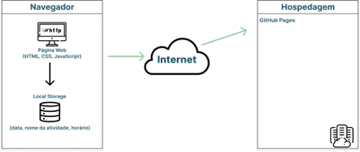

# Arquitetura da Solução

Pré-requisitos: <a href="3-Projeto de Interface.md"> Projeto de Interface</a>

Nesta seção são apresentados os detalhes técnicos da solução criada pela equipe, tratando dos componentes que fazem parte da solução e do ambiente de hospedagem da solução.

## Diagrama de componentes

Os componentes que fazem parte da solução são apresentados na Figura que se segue. 

 
Figura 8 - Arquitetura da Solução

A solução implementada conta com os seguintes módulos:

- **Navegador** - Interface básica do sistema  
  - **Páginas Web** - Conjunto de arquivos HTML, CSS, JavaScript e imagens que implementam as funcionalidades do sistema.
   - **Local Storage** - armazenamento mantido no Navegador, onde são implementados bancos de dados baseados em JSON. São eles: 
     - **Data** - Data atual.
     - **Nome da Atividade** - Nome da atividade.
     - **Hora Inicial** - Hora que inicia determinada atividade.
     - **Hora Final** - Hora que finaliza a atividade.
     - **Tempo de Estudo** - Tempo de estudo determinado pelo usuário.
     - **Tempo de Descanso** - tempo de descanso determinado pelo usuário.
     - **Status** - Status da atividade (Não iniciado, em andamento, concluído).
     - **Progresso**-Registro do progresso da atividade (em percentual).
 - **Hospedagem** - local na Internet onde as páginas são mantidas e acessadas pelo navegador. 

## Hospedagem:

O site utiliza a plataforma do GitHub Pages como ambiente de hospedagem do site do projeto. O site é mantido no ambiente da URL: 

https://icei-puc-minas-pmv-ads.github.io/pmv-ads-2022-1-e1-proj-web-t9-pomodoro-s-organizer/

A publicação do site no GitHub Pages é feita por meio de uma submissão do projeto (push) via git para o repositório remoto que se encontra no endereço: 
https://github.com/ICEI-PUC-Minas-PMV-ADS/pmv-ads-2022-1-e1-proj-web-t9-pomodoro-s-organizer
