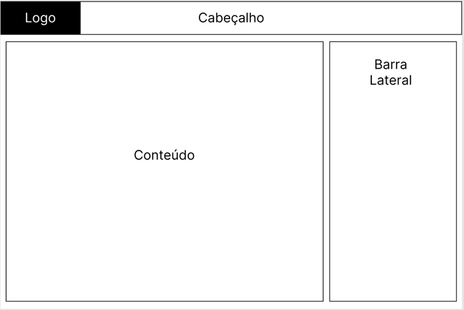
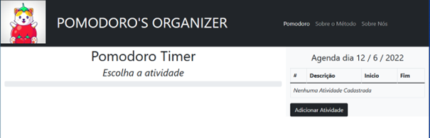

# Template padrão do site

O padrão de layout a ser utilizado pelo site tem correspondência ao projeto de Interface elaborado anteriormente, conforme Figura 9.

 
Figura 9- Template padrão do site

O template criado está disponível no site https://icei-puc-minas-pmv-ads.github.io/pmv-ads-2022-1-e1-proj-web-t9-pomodoro-s-organizer/ e é composto pelos seguintes layouts: 

- Cabeçalho
- Conteúdo
- Barra lateral

A responsividade segue o padrão do Bootstrap

## Tela Principal

Tela que abrange uma barra de navegação para todas as páginas do site e funcionalidades da solução.

 
Figura 10 - Tela Principal.

## Criação de atividade
Este layout é utilizado para criação de atividades.

 
Figura 11 - criação de atividades.
 

## Tela de Visualização das atividades criadas
Local onde são exibidas as atividades criadas.

 
Figura 12 - Exibição de Atividades.