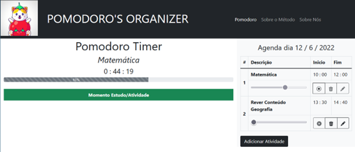

# 7.	Funcionalidades do Sistema (Telas)

Nesta seção são apresentadas as telas desenvolvidas para cada uma das funcionalidades do sistema. O respectivo endereço (URL) e outras orientações de acesso são apresentadas na sequência.

## Timer Pomodoro e Agenda (RF-01, RF-02 e RF-03)

A tela principal do sistema apresenta a agenda de estudos bem como o timer Pomodoro, todos os dados para o funcionamento estão armazenadas no LocalStorage com estruturas dados baseada em JSON. Um exemplo da tela é apresentada na Figura 13. 

<br>
Figura 13 - Tela principal com agenda preenchida.

**Requisitos atendidos**

-	RF-01 - O site deve apresentar uma ferramenta de agenda para incluir e gerenciar as matérias que devem ser estudadas em cada horário.

-	RF-02 - O site deve apresentar um timer dentro da metodologia Pomodoro que informa o usuário se é um momento de estudo ou de intervalo.

- RF-03 - A agenda deve conter uma barra de status para que o usuário possa controlar o progresso de cada atividade.

**Artefatos da funcionalidade**

- index.html
- pomodoro.html
- agenda-frame.js
- pomodoro.ico

**Estrutura de Dados**

```
{
   	 “nome”:   “História”,
   	 inicio: {
   		 hora:  10,
   		 minuto: 00,
   		 tempo: 600,
   	 },
   	 fim: {
   		 hora: 11,
   		 minuto: 00,
   		 tempo: 660,
   	 },
   	 status: 0,
   	 progress: 0,
   	 }
```
**Instruções de acesso**
1. Abra um navegador de Internet e informe a seguinte URL: https://icei-puc-minas-pmv-ads.github.io/pmv-ads-2022-1-e1-proj-web-t9-pomodoro-s-organizer/
2. A tela do timer pomodoro e agenda primeira funcionalidade exibida pelo aplicativo.