# Registro de Testes de Software

Os resultados obtidos nos testes de software realizados são descritos abaixo. 

## CT-01 - Cadastrar com sucesso uma atividade
**Critério de êxito:** site informa a mensagem “Inclusão de dados realizada”; atividade registrada no menu “Agenda”

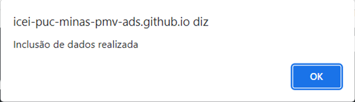 
Evidência 01 - mensagem de sucesso.

 

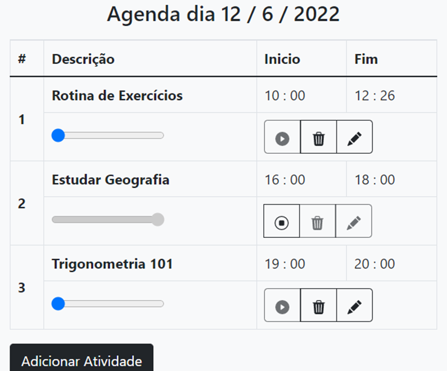 
Evidência 02 - atividade registrada no menu agenda.

## CT-02- Cadastrar uma atividade sem informar o nome da atividade

**Critério de êxito:** botão “Confirmar” permanece inativo

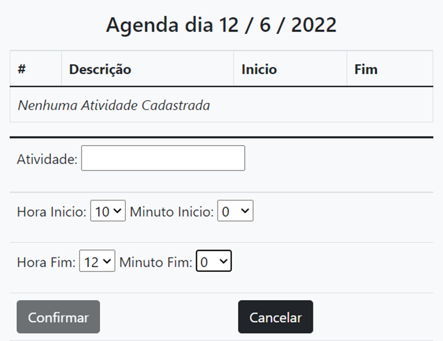 
Evidência 03 - botão “Confirmar” permanece inativo.

## CT-03 - Cadastrar uma atividade sem informar o horário de início da atividade

**Critério de êxito:** botão “Confirmar” permanece inativo.

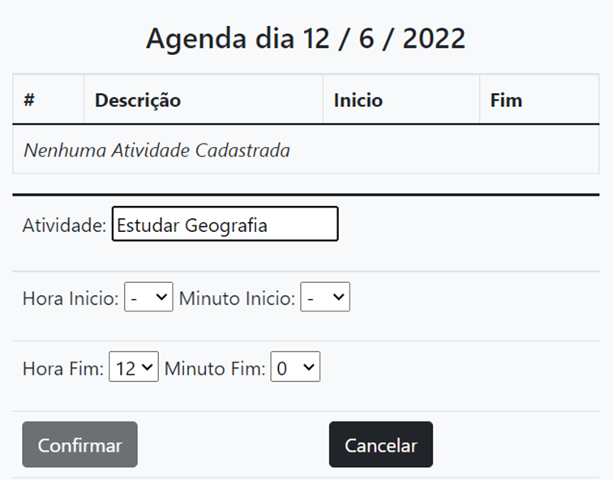 
Evidência 04 - botão “Confirmar” permanece inativo

## CT-04 - Cadastrar uma atividade sem informar o horário de término da atividade

**Critério de êxito:** botão “Confirmar” permanece inativo
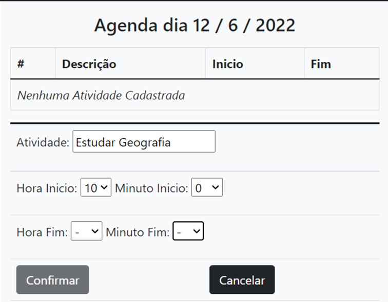 
Evidência 05 - botão “Confirmar” permanece inativo

## CT-05 - Completar uma atividade por completo##

**Critério de êxito:** Site informa a mensagem “PARABÉNS! TAREFA CONCLUÍDA!”; site informar barra de progresso com o status 100%

**Critério de êxito:** botão “Confirmar” permanece inativo

 
Evidência 06 - status de conclusão de uma tarefa

## CT-06- Cadastrar uma atividade com coincide com o horário de outra atividade já cadastrada

**Critério de êxito:** site informa a mensagem “O Fim da atividade coincide com outra atividade já programada”

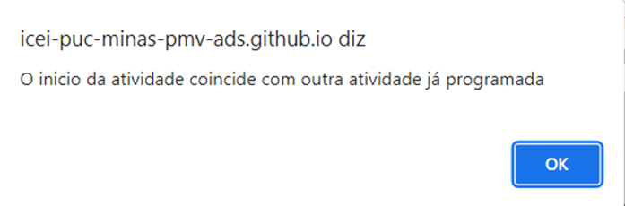 
Evidência 07 - mensagem de erro

## CT-07- Deletar uma atividade com sucesso

**Critérios de êxito:** atividade é removida do menu “Agenda”

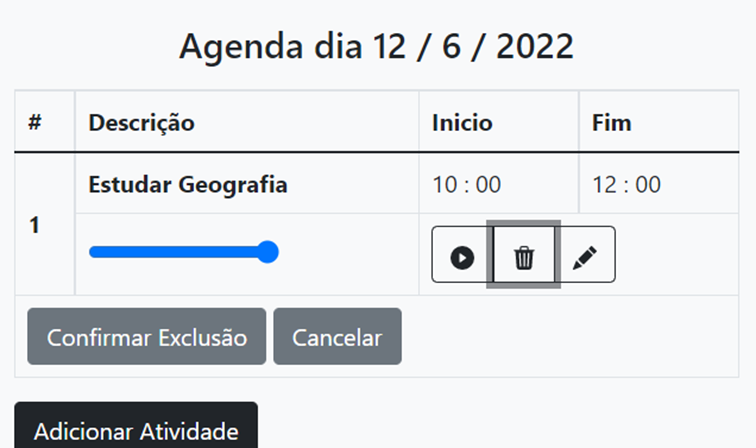 
Evidência 08 - exclusão de atividade

 

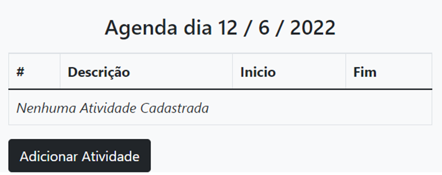 
Evidência 09 - atividade removida do menu “Agenda”

## CT-08- Editar uma atividade com sucesso

**Critério de êxito:** sistema informa a mensagem “Inclusão de dados realizada com sucesso”; atividade com os dados alterados aparece no menu agenda

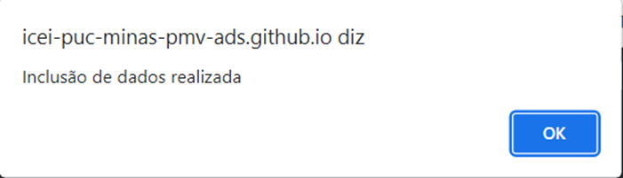 
Evidência 10 - mensagem de sucesso

 

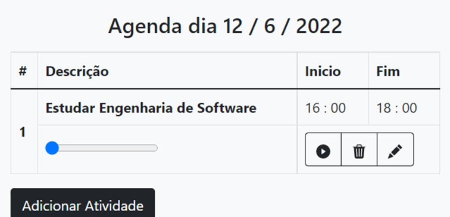 
Evidência 11 - atividade com dados alterados presente no menu “Agenda”

## CT-09- Deixar uma atividade em execução além do tempo determinado

**Critério de êxito:** barra de status informa o valor de 100%

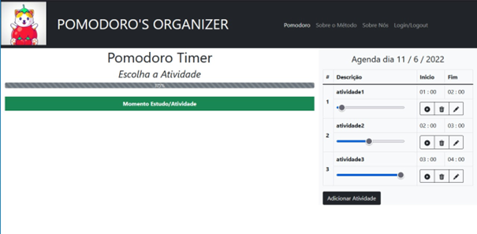 
Evidência 12 - barra de status informa um valor maior que 100%